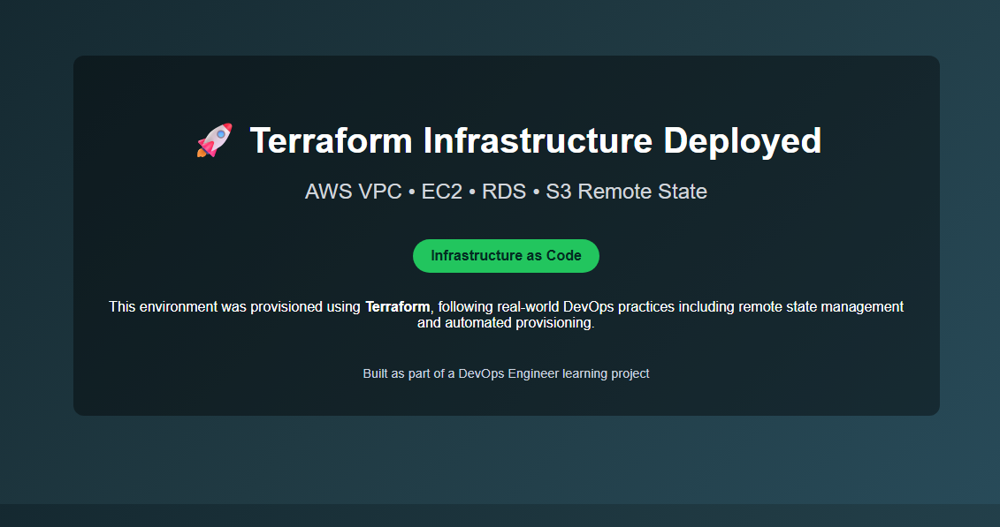
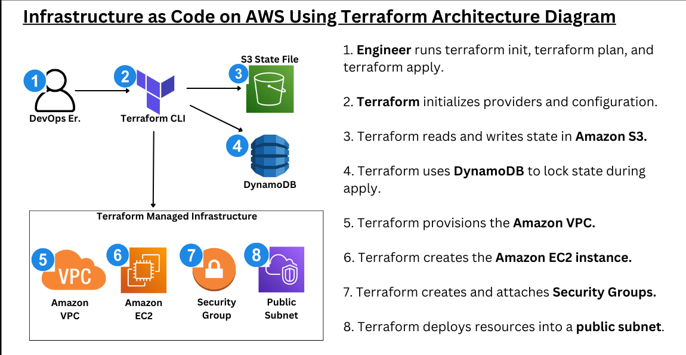

# 🚀 Terraform AWS Infrastructure



This project provisions a complete AWS infrastructure using **Terraform** with a **modular architecture** and **remote state management**.

---

## 🏗️ Architecture Diagram



---

## 🔍 Architecture Overview

This infrastructure is deployed using Terraform and follows real-world DevOps practices.

### Workflow:

1. Engineer runs Terraform commands (`init`, `plan`, `apply`)
2. Terraform initializes providers and modules
3. State is stored remotely in **Amazon S3**
4. **DynamoDB** is used for state locking
5. A **VPC** is created with public subnets
6. An **EC2 instance** is deployed as a web server
7. An **RDS MySQL database** is provisioned
8. **Security Groups** manage access control between components

---

## ⚡ Key Highlights

- Modular Terraform architecture (`network`, `compute`, `database`)
- Remote state management using **S3 + DynamoDB**
- Infrastructure refactoring using `terraform state mv`
- Zero-downtime refactor (no resource destruction)
- Production-style infrastructure design

---
## 🧱 Project Structure

```
terraform-aws-iac/
│
├── modules/
│   ├── network/   # VPC, subnets, routing
│   ├── compute/   # EC2 instance + security group
│   └── database/  # RDS + subnet group
│
├── main.tf        # Root module (wiring layer)
├── variables.tf
├── outputs.tf
├── snapshot.png   # Web UI screenshot
├── architecture.png # Architecture diagram
└── README.md
```

---

## 🛠️ Tech Stack

- Terraform
- AWS (EC2, RDS, VPC, S3, DynamoDB)
- Infrastructure as Code (IaC)

---

## 🚀 Deployment

```bash
terraform init
terraform plan
terraform apply
```
## Remote State
Stored in Amazon S3
State locking handled via DynamoDB

## 🎯 What I Learned
```
Designing modular Terraform architecture
Managing infrastructure state safely
Refactoring Terraform code without destroying resources
Understanding dependencies between AWS components
Applying real-world DevOps practices
```
